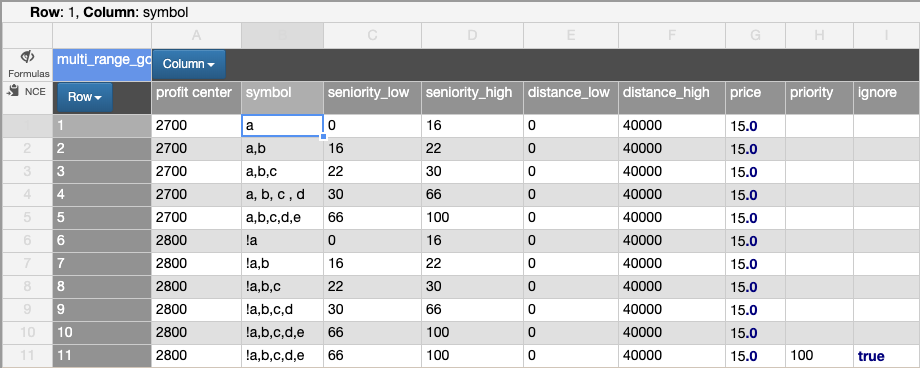
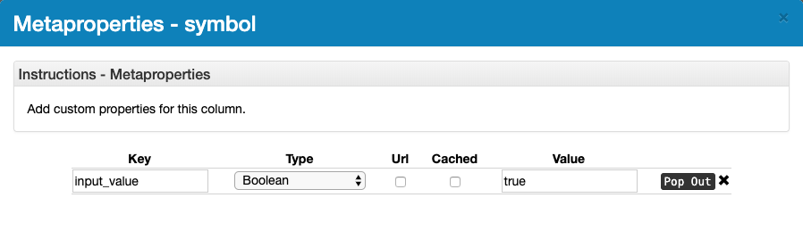
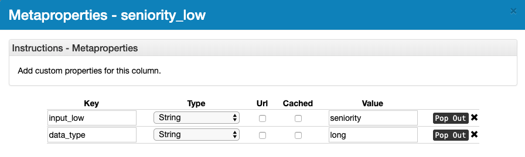
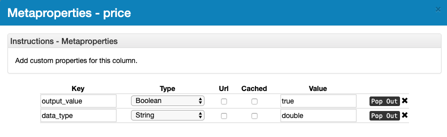

# Decision Table
The `DecisionTable` class is instantiated with a 2D `NCube`, where one axis contains
decision columns and output columns, denoted by meta-properties, and the other axis
represents rows.

#### Example
  

Decision **inputs** in the above picture are **profit center**, **symbol**, **seniority** (range input), and **distance** (range input).
These are indicated by `meta-properties` on the columns.
   
---

  

For the case of **profit center** and **symbol**, they have the `input_value` key (type `Boolean`) with the value `true`.
 
---

  

For `range` inputs (**seniority** and **distance**), there are two meta-properties to define on the `Column`. The
key of `input_low` is mapped to the name of the input variable (**seniority**).  The `data_type` key is mapped to the 
data type of the values that will be compared (`Long`, `Date`, `Double`, `Big_decimal`, `String`).  Both the keys and the values
are **case insensitive**.

For both `input_value` (single discrete input) and `input_low/input_high`, a `required` meta-property can be set as well. 
If this is set, and a call is made to
```
   dt.getDecision(Map)
```
 and the input variable is missing on the input `Map`, an `IllegalArgumentException` will 
be thrown to the caller, indicating which `required` keys are missing.
 
---



**Price** is an **output**.  It takes two meta-properties to define a `DecisionTable` output.  There must be an `output_value`
meta-property key (`boolean` type) with the value `true`.  Also, a `data_type` meta-property must be specified. 
It can have one of the following values: (`Long`, `Date`, `Double`, `Big_decimal`, `String`).  Both the keys and the values
are **case insensitive**.  The output from a call to the `DecisionTable` will consist of the columns marked with `output_value`
and the values will be `cast` to the `data_type` specified.

The output looks like this:
```
    "row_1_id" :{"outputColName1": output1-1, "outputColName2": output2-1, ...}
    "row_17_id":{"outputColName1": output17-1, "outputColName2": output2-17, ...}    
```
Normally, there would only be `0` or `1` row.  In most cases, an output of more than `1` row indicates and overlap in the 
rule definitions.

--- 
 
#### Validation
To verify that only one (or zero) rows are going to be returned, you can call the

```
    Set rows = dt.vadlidateDecisionTable()
``` 
API.  This API will **'bike lock'** all input values defined for each input column in the `DecisionTable`, and test 
against each row, looking for an instance where more than one row is returned.  The returned `Set` will be empty if there 
are no overlaps, otherwise the `Set` will contain the IDs for each row that overlaps some other row. 
 
---

#### Ignore
In the first picture, there is an `ignore` column.  The ignore column is indicated
by the meta-property `ignore` with the boolean value of `true`.  The column can be named `ignore` instead
of using a meta-property.  When attempting to match rows in the `DecisionTable`, rows with a value of boolean `true`
will not be considered. The value in the column can be `1` or `0`, `true` or `false`, or `"true"` or `"false"`.

---

#### Priority
In the first picture, there is a `priority` column.  The priority column is indicated
by the meta-property `priority` with the `integer` value of `0 to max int`.  The column can be named `priority` instead of
using a meta-property.  The priority is used to specify which row is picked if more than one row matches.  This allows 
having a large date range (for example), and then smaller 'spot' ranges to be added.  If the large spanning date range has a 
priority of 5000 and the smaller 'spot' range has a priority of '1000', then the row returned will be the one with
the priority closest to 1.  The values can range from 1 to 2 billion.

---
  
#### API 
The main API is `getDecision(Map<String, ?> input)` which scans the table using the input coordinate, 
and returns the rows that match it.  The `Map<> input` contains the keys that match columns with
`INPUT_VALUE: true` on their meta-properties.  The key value has the same text as the column value
on the 2D `NCube` 'field' axis.  The value side of the input coordinate is compared with equality
against all rows in the NCube.

If there is more than one column marked with `INPUT_VALUE true`, then each of those columns must
match a value in the same row in order for the row to be returned. Actually, the row is not returned
but all the values in the columns that are marked with the `OUTPUT_VALUE: true` are returned.

The return is a `Map` looks like:
```groovy
['134': [price: 1.0, commission: 15.0]]
```                                     
where `134` is the row ID (the row axis can have any name, must be `Axis.axisType (DISCRETE)`, and can be any 
`Axis.axisValueType (LONG, STRING, etc.)`.

In this example, the input was:
```groovy
[state:'OH', 'SKU': 12345]
```
and that input matched row `134` which had a value of `OH` for `state` and the value `12345` for `SKU`.
Both the `state` column and the `SKU` column have the meta-property `INPUT_VALUE: true`.

---

#### Field axis
The field axis contains the top columns of the decision table.  The axis can have any name you want.
The field axis must be a `DISCRETE` axis, with the value type of `CISTRING`.

On the field axis, some columns are meant to match the input `Map`, some columns contain the output values.
Here are all the special meta-properties and their meanings:
  
* `INPUT_VALUE` with value `true`: This is a decision variable, and the column name is matched against the input coordinate key. 
* `OUTPUT_VALUE` with value `true`: This is an output variable. The values in these columns are returned from the matched rows.
* `INPUT_LOW` with the value that matches the name of a key that will be supplied for a range input.  For example, `date`
* `INPUT_HIGH` with the value that matches the name of a key that will be supplied for a range input.  For example, `date`
  * The `INPUT_LOW` and `INPUT_HIGH` columns work to match range inputs, like dates, etc. In this example, if the input
    `Map` contains a key of `date: 2020/02/14` then it will match the range if the input date is >= (greater than or equal) to
    the row value in the 'low' column and < (less than) the value in the 'high' column.
* `DATA_TYPE` must be specified on range columns (ones marked with `INPUT_LOW` and `INPUT_HIGH`).  This indicates the
data type that will be compared against the ranges. Valid values are `DATE`, `LONG`, `BIG_DECIMAL`, and `DOUBLE`.

---

#### Row axis
The row axis typically has values 1 through the number of rows.  This axis must be `DISCRETE`, however, the axis value
type can be `LONG`, `STRING`, `CISTRING`, `DOUBLE`, `EXPRESSION`, `BIG_DECIMAL`, or `COMPARABLE`.  The values from
the `Columns` on the row axis are not matched against any input, however, they are used as the keys in the `Map` of 
the returned matching rows. 